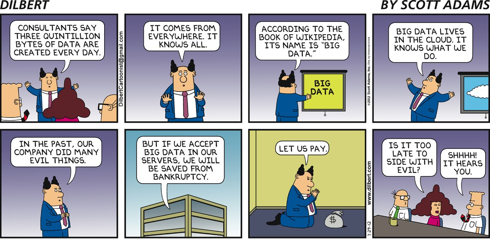

Information Visualization Measurement and Evaluation
=======

_Cathryn Ploehn_

This resource gives a summary of information visualization including: 

- An overview of information visualization meant for _researchers_ outside the visualization field, 
- approaches (or lack thereof) to measurement and evaluation of information visualization 

> "Graphics is the visual means of resolving logical problems" - Jacques Bertin

##Contents

####1. What is visualization?

[Guiding Principles of Information Visualization](Guiding Principles of Information Visualization.md)

[Semiology of visualization](Semiology of visualization.md)

[Creating a visualization](Creating a visualization.md)

<!-- [Types of Visualizations](Types of Visualizations.md) -->

####2. Evaluating visualization

[Assessing information visualization](Assessing Information Visualization.md)

[Designing a new evaluation framework](Designing a new evaluation framework.md)

####3. Other

[Resources](Resources.md)

=====

#First, an introduction

Information is everywhere. Data is everywhere. 

 [dilbert, 2012](http://dilbert.com/strip/2012-07-29)

>Everywhere you look, the quantity of information in the world is soaring. According to one estimate, mankind created 150 exabytes (billion gigabytes) of data in 2005. This year, it will create 1,200 exabytes. [The Economist, 2010](http://www.economist.com/node/15579717)

Apparently we've been drowning in data since at least 1989 (Wurman 1989). Shouldn't looking through all this data be "a joyous experience"? (Shneiderman 1996). 

So what can be done? Human visual perception is powerful - why not leverage it when analyzing data? We can perceive images and derive concepts from them in as little as 13 milliseconds (Potter et al. 2014). Beyond just fast perception, can we use images to amplify cognition and understanding? This is where visualization comes in.

##What is visualization?

Visualization has become a loaded word. 

In the classic work _Readings in information visualization: using vision to think_, Card et al. (1999) refer to data visualization and information visualization as:

> "the use of computer-supported, interactive, visual representations of abstract data to amplify cognition."

This definition is similar to a more recent definition by Chen et al. (2014):

> "__Visualization__ is a study of transformation from data to visual representations in order to facilitate effective and efficient cognitive processes in performing tasks involving data."

There are many types of visualizations, however, I'll focus on _computer supported data visualization_, which features data and computers. 

## Knowledge vs information 

Bertin (1981) distinguishes between graphics used for communication and graphics leveraged in processing data. The process of solving a problem involves distinct types of graphics, or visualizations. __Knowledge visualizations__ communicate the answers discovered through __information visualizations__. Information visualizations are visual analytic tools for exploring and extracting patterns from abstract data. 

We use knowledge visualization to communicate ideas:

 _xkcd_

And we use (sometimes cryptic) information visualization to discover patterns in data:

 _spatial-analyst.net_

In addition to focusing on _computer supported data visualization_, I will also focus on _information visualization_. (Although some concepts may also apply to knowledge visualization)

##Why information visualization is important

The display of data is a potentially __powerful tool for data analysis__. This is where the very capable human visual perceptive systems come in to play. 

Many researchers talk about the benefits of visualization in terms of its ability to amplify our cognition of and increase insights gleaned from data (Chen at al. 2014, Meirelles 2013).

For example, this is what visualization can do to aid our congition (Meirelles 2013):
- record information
- convey meaning
- increase working memory
- facilitate search
- facilitate discovery
- support perceptual inference
- enhance detection and recognition
- provide models of actual and theoretical worlds
- provide manipulation of data

What about the data specifically? Visualization \-
- allows thorough __exploration of the structure of data__ (Cleveland 1994). In contrast, many techniques of data analysis, which leverage data reduction - reduce the data to a handful of statistics. 
- is a form of data analysis that can be leveraged to "convey the wealth of information that exists in data" (Cleveland 1994). 
- allows for the encounter or surprises of the data, "yielding conclusions to questions not originally asked" (Cleveland 1994). 

> "The graph retains the information in the data" - W. Edwards Deming 

Visualizations are powerful because it they are tools that can "strengthen our mental abilities." (Card et al. 1999, Bertin 1983, Norman 1993, Tversky 2001, Ware 2004)

Chen et al. (2014) also point out one of the most attractive, measureable features of visualization from a cost-benefit point of view:

_Visualization saves time._ 

[< Jump to top of page](README.md)

#Disclaimer

“The United States Department of Commerce (DOC) GitHub project code is provided on an ‘as is’ basis and the user assumes responsibility for its use. DOC has relinquished control of the information and no longer has responsibility to protect the integrity, confidentiality, or availability of the information. Any claims against the Department of Commerce stemming from the use of its GitHub project will be governed by all applicable Federal law.Any reference to specific commercial products, processes, or services by service mark, trademark, manufacturer, or otherwise, does not constitute or imply their endorsement, recommendation or favoring by the Department of Commerce. The Department of Commerce seal and logo, or the seal and logo of a DOC bureau, shall not be used in any manner to imply endorsement of any commercial product or activity by DOC or the United States Government.”

# Sources

Bertin, J. (1981). Graphics and graphic information processing. Walter de Gruyter.

Bertin, J. (1983). Semiology of graphics: diagrams, networks, maps.

Card, S. K., & Mackinlay, J. (1997, October). The structure of the information visualization design space. In Information Visualization, 1997. Proceedings., IEEE Symposium on (pp. 92-99). IEEE.

Card, S. K., Mackinlay, J. D., & Shneiderman, B. (1999). Readings in information visualization: using vision to think. Morgan Kaufmann.

Chen, M., Floridi, L., & Borgo, R. (2014). What is visualization really for?. In The Philosophy of Information Quality (pp. 75-93). Springer International Publishing.

Chen, C., & Yu, Y. (2000). Empirical studies of information visualization: a meta-analysis. International Journal of Human-Computer Studies, 53(5), 851-866.

Cleveland, W. S., & McGill, R. (1984). Graphical perception: Theory, experimentation, and application to the development of graphical methods. Journal of the American statistical association, 79(387), 531-554.

Mackinlay, J. (1986). Automating the design of graphical presentations of relational information. Acm Transactions On Graphics (Tog), 5(2), 110-141.

Meirelles, I. (2013). Design for Information: An Introduction to the Histories, Theories, and Best Practices Behind Effective Information Visualizations. Rockport publishers.

Norman, D. A. (1993). Things that make us smart: Defending human attributes in the age of the machine. Basic Books.

Potter, M. C., Wyble, B., Hagmann, C. E., & McCourt, E. S. (2014). Detecting meaning in RSVP at 13 ms per picture. Attention, Perception, & Psychophysics, 76(2), 270-279.

Shneiderman, B. (1996, September). The eyes have it: A task by data type taxonomy for information visualizations. In Visual Languages, 1996. Proceedings., IEEE Symposium on (pp. 336-343). IEEE.

Tversky, B. (2001). Spatial schemas in depictions. In Spatial schemas and abstract thought (pp. 79-111).

Ware, C. (2004). Information visualization: perception for design. San Francisco, CA: Morgan Kaufmann.

Wurman, R. S. (1989). Information anxiety. Doubleday.