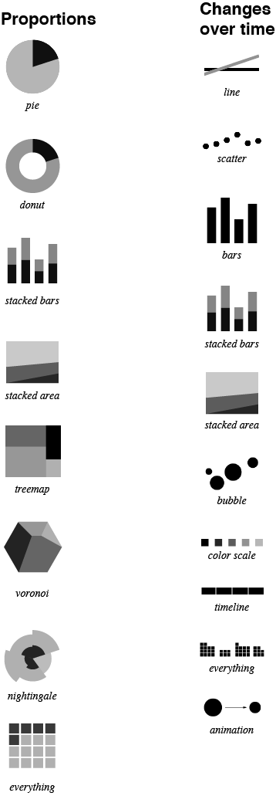

[< Back to home](README.md)

#Examples of Visualizations

So, what can we do with visualizations? It depends on your data. (For more information on data, see [Semiology of visualization](Semiology of visualization.md)).

##Visualizing cats

__What happens when you get close to a cat?__

 _xkcd_

__Where does your cat live?__

 _The [I Know Where Your Cat Lives](http://iknowwhereyourcatlives.com/) project_

__How interested have people been in cats compated to poverty?__

## Ordinal

## Nominal
###Hierarchical
Cladogram
Dendogram
Treemap
Circle packing
Sunburst
tree
Zoomable partition layout

###Network
Graph
hyperbolic tree
Chord diagram
Hive plot
Flow

Sankey
Flowchart
Co-occurance matrix

## Quantitative
###Temporal and Proportional

[Adapted from flowingdata](http://flowingdata.com/)

###Multivariate
Slopegraph
Parallel coordinates
Heatmap

###Statistics
Multidimensional scaling
Box plots

###Other
Dot plot

#Visualization tools

These tools bring many concepts above together and allow for dynamic exploration of the data. 

[< Back to home](README.md)
