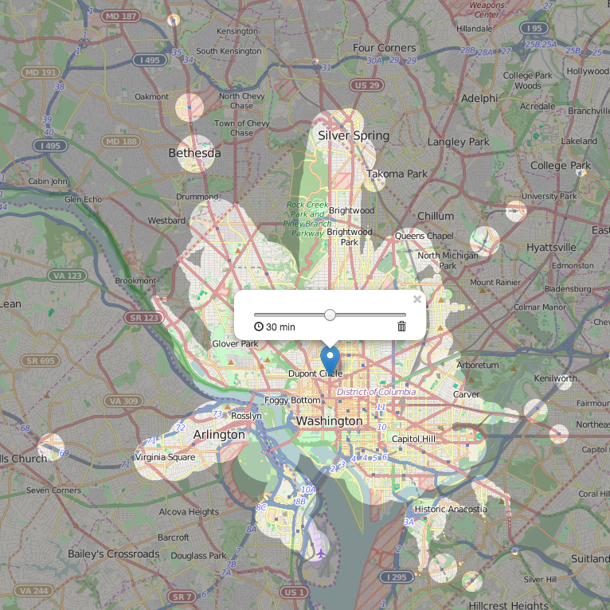
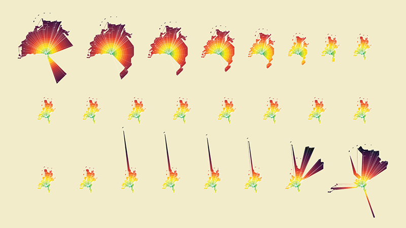
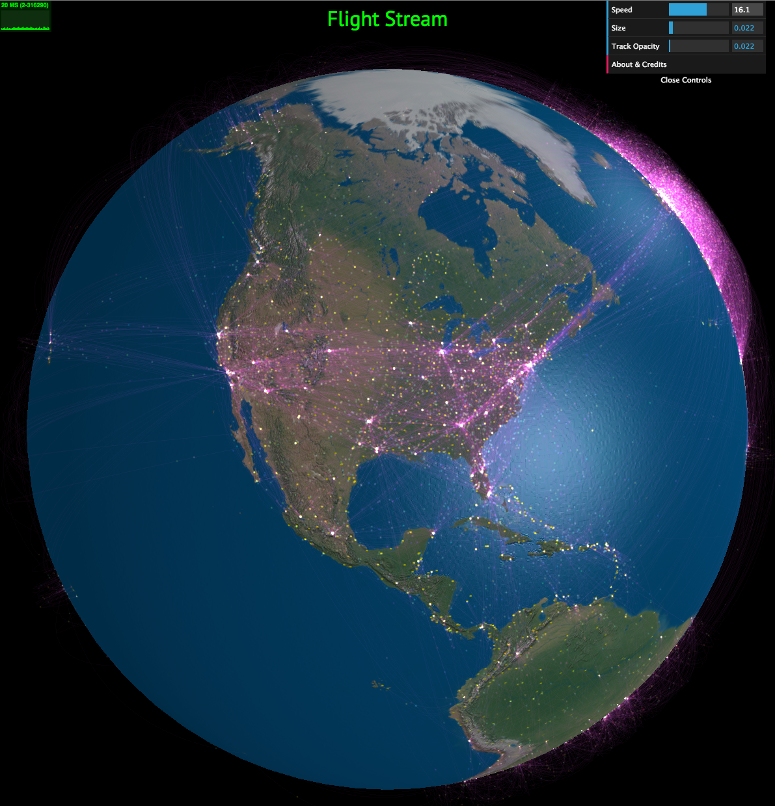

[< Back to home](README.md)

#Visualizing traffic flow

Changes is many dimensions change all around us over time. Time-varying data can be used to explore patterns in many phenomena, natural and unnatural. In particular, the dimensions of space and time, spatio-temporal data, are important in many domains for studdying patterns such as diffusion, proliferation, and mobility (Meirelles 2013). In particular, data representing the flow of cars on roads is a spatio-temporal structure. In order to understand how to visualize traffic flow, a look into the techniques used to analyze spatio-temporal data is necessary. 

[Traffic congestion in Dublin, IBM Research](http://vtce.altervista.org/vis.html)

[Visualization of 5 years of traffic fatalities](http://io9.com/5970486/visualizing-5-years-of-traffic-fatalities-what-is-the-deadliest-time-to-drive)

The field Geo visualization is involved in designing tools to analyze spatio-temporal data. The final product often integrates visual elements beyond maps, such as visualizations representing statistical data in order to better capture the complexity of the data.  

>Hence, spatial data have a complex structure involving space, time, and a number of thematic attributes, which poses significant challenges to the visualization. _\- Commission on GeoVisualization of the International Cartographic Association_

The main restriction in geovisualization is a typical need to adhere to a representation of the physical space, a restriction that does not apply to abstract data spaces (ICA Commission on GeoVisualization). Additionally, a single static image is insufficient to represent changes in thematic data of spatial phenomena. Traditional carographic techniques in addition to 3D and interactive visualizations are typically used in modern geovisualization software. 

Geovisualizations can also incorporate multiple linked views, providing different perspectives of a dataset (ICA Commission on GeoVisualization).

Geo-spatial phenomena can be organized by change in the spatial domain :
- appearance/disappearance: emergence or vanishing of a phenomenon
- mutation: change in a thematic attribute component of an existing phenomena
- movement: change in spatial position and/or geometry of a phenomenon

or by the temporal domain:
- movement in time: time instant or time interval at which a change starts
- pace: rate of change over time
- duration: length of time involved in the change
- sequence:  "order of phases in a series of changes"
- frequency: "number of times a phase is repeated in a series of changes in the spatial domain"

##Techiques

Trajectories, flow maps, and space-time cubes are common techniques ued to visualize spatio-temporal data. 

Like previously mentioned, one image is not sufficient to represent the changes in thematic data in a single static image (Meirelles 2013). Thematic data can be represented with these techniques: multiple maps, animation, and interactive tools.

Multiple maps involves displaying a sequence of maps, each representing a single state. This technique allows all change to be viewed simulteously. Multiple maps tend to encourage focus on spatial patterns instead of events or temporal processes (Andrienko et al. 2010). 

For example, below is a visualization of vehicle counts over time in the UK.

[Vehicle counts over time by ITO World for the data.gov.uk launch event](http://www.itoworld.com/static/data_gov_uk_launch.html)

Animation involves creating a mapping of the spatial phenomena onto physical time. Different states are shown over a certain period of time. This method has some limitations, including the difficulty in making comparison tasks with previous states (Meirelles 2013).

Below is a still of an interactive heatmap representing the flow of taxi cabs in New York. The heatmap animates over a number of stills to show the changes in taxi flow over time through a typical week.

[Flow of taxis in New York City](http://www.nytimes.com/interactive/2010/04/02/nyregion/taxi-map.html?_r=0)

Interactive tools can help reduce the limitations of animation techniques by allowing a custom mapping of spatial phenomena onto physical time, allowing the adjustment of the physical time scale to increase the visibility of the phenomena. Animation and interactive tools tend to encourage user focus on changes and events rather than spatial configurations (Andrienko et al. 2010).

##Time

Two aspects of time are critical in dealing with spatio-temporal data (Andrienko et al. 2010): 

- the structure of the temporal dimension: Ordered time, branching time, multiple perspectives
- temporal primitives: points in time, time intervals

A third aspect of time, cycles and reoccurances, is also relevant in studying spatio-temporal data (Meirelles 2013).

[Charles Minard's map of Napoleon's disastrous Russian campaign of 1812, wikipedia](https://en.wikipedia.org/wiki/Charles_Joseph_Minard)

###Time as distance

Throughout history, humans have used space and motion as prime metaphors to represent time (Meirelles 2013). For example, the movement of celestial bodies was used to represent and measure time (Vasiliev 1997). Another example is the longitude coordinate system, with each hour corresponding to 15 degrees of longitude (Vasiliev 1997).

The time as distance metaphor is common, employed in situations as describing such as a coffee shop as being "a ten minute walk away." Time replaces the spatial distance between two points (Meirelles 2013). 

Isochronic maps and distance cartograms are two techniques leveraging this metaphor. 

What is located 30min away? Isochronic map of public transport in Washington D.C. (Source: mapnificent.net/washington/).

Isochronic maps represent travel times using isolines (an outline forming a shape that represents a particular travel time from a defined origin point). A popular historical example of isochronic maps is Galton's isochronic passage charts, showing the average travel time to different parts of the world from London in 1881.

Distance cartograms use temporal distance instead of spatial distance in displaying maps. The original topology of a map is distorted to fit into the temporal measures (Meirelles 2013). A center point represents the origin. Concentric circles around the origin point represent time intervals, and places are mapped to different concentric circles based on their distance from the origin point. 

[Vincent Meertens' TimeMaps](http://www.vincentmeertens.com/timemaps/)

##Scales

The scales of the spatio-temporal phenomena differ, affecting the detail of data represented in the resulting visualization (Meirelles 2013). Scales must be altered to fit into the scale of human perception. This is because many geographic phenomena are too fast or too slow to be comprehended (MacEachren 2004). Often, both time and space must be compressed to be grasped by humans (MacEachren 2004). 

The way in which the data is scaled will depend on both the data and the tasks to be performed with the data. The apropriate scale is often discovered through the analysis process through trial and error. Analytic tools must "support analyses multiple scales, considering the specifics of space and time" (Andrienko et al. 2010). Furthermore, smaller phenomena are nested within larger phenomena, reflecting the notion of a hierarchy of scales (Andrienko et al. 2010).

For example, in the visualization below, the animation of flight movement across the globe have been compressed in time, and can be scaled from a factor of 1 to 25.

[Still of Flight Stream](http://callumprentice.github.io/apps/flight_stream/index.html#)

#Sources

Andrienko, G., Andrienko, N., Demsar, U., Dransch, D., Dykes, J., Fabrikant, S. I., ... & Tominski, C. (2010). Space, time and visual analytics. International Journal of Geographical Information Science, 24(10), 1577-1600.

Blok, C. (2000). Monitoring change: characteristics of dynamic geo-spatial phenomena for visual exploration. In Spatial cognition II (pp. 16-30). Springer Berlin Heidelberg.

Galton, F. (1881). On the construction of isochronic passage-charts. In Proceedings of the Royal Geographical Society and Monthly Record of Geography (pp. 657-658). Edward Stanford.

MacEachren, A. M. (2004). How maps work: representation, visualization, and design. Guilford Press.

Meirelles, I. (2013). Design for Information: An Introduction to the Histories, Theories, and Best Practices Behind Effective Information Visualizations. Rockport publishers.

Vasiliev, I. (1997). Mapping time. Cartographica: The international journal for geographic information and geovisualization, 34(2), 1-51.

[ICA Commission on GeoVisualization](http://geoanalytics.net/ica/)